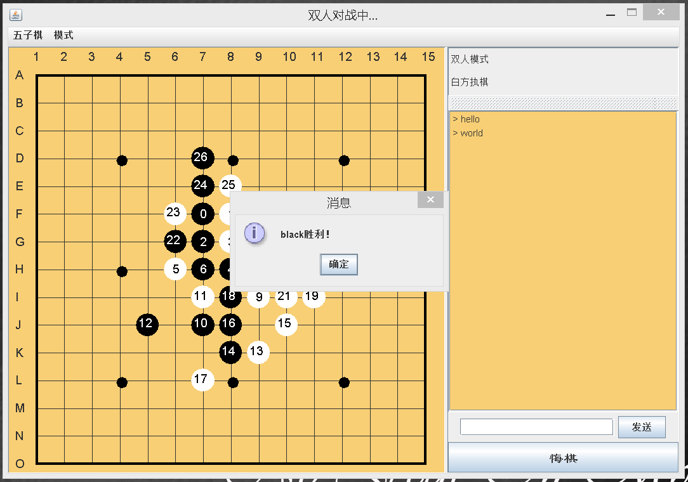
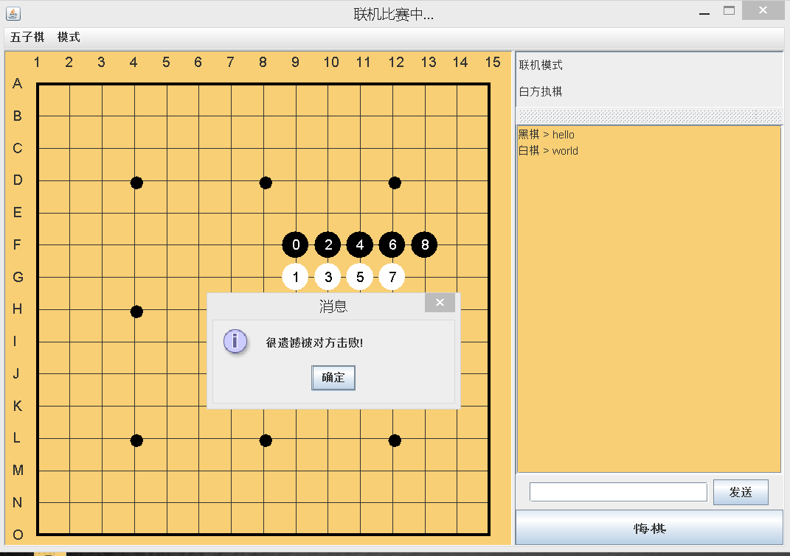
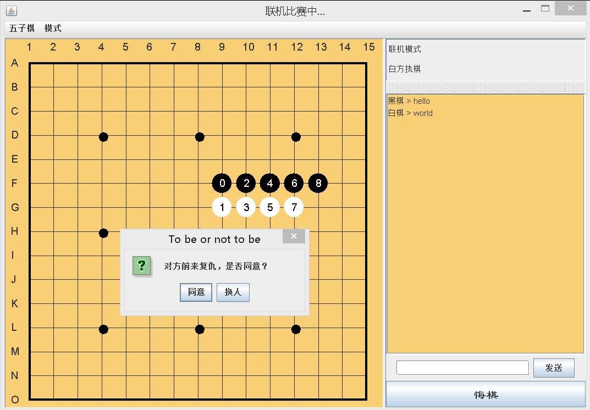
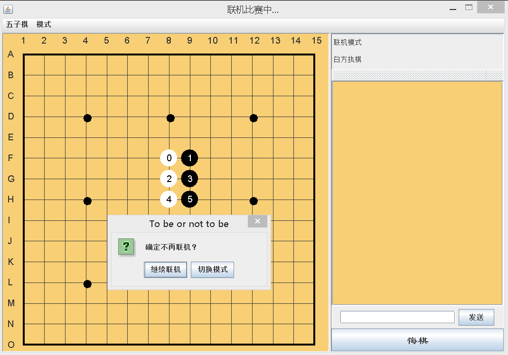
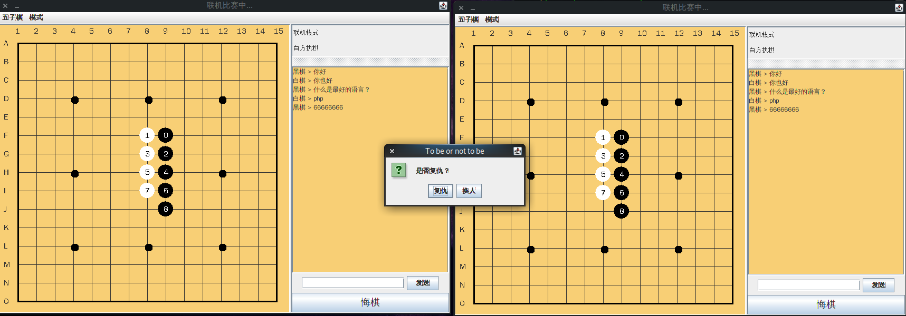

# 五子棋

## 游戏介绍

​利用java开发的具有人机、双人、联机、聊天等功能的五子棋

## 功能介绍

### 基本框架

实现五子棋的界面设计和游戏逻辑，包括菜单栏、棋盘、棋子、状态栏、聊天框、胜负判断、悔棋、保存棋谱、演示棋谱等

#### 胜负判断

比较简单，每次落子后检测是否连成五子，具体方法为：
以落子点为中心分别向上、下、左、右、左上、右下、左下、右上八个方向计算颜色相同的棋子个数，若其中任意一条直线满足条件，则游戏结束

#### 保存、演示棋谱

创建一个```LinkedList<point>```记录每次落子点，结束后写入文件，演示时读取文件模拟落子即可。

### 双人

按照黑白棋轮流落子，逻辑简单，不表

### 人机

利用博弈搜索树等相关算法设计AI，聊天...随机访问聊天库 :-)

AI核心为：将当前局面看作根进行递归搜索，建立搜索树，每次为搜索点打分，利用极大极小算法剪枝优化搜索范围、置换表优化搜索效率、多线程优化搜索时间，找出最佳落子点，甚至必胜态。

由此可知，递归层数越多，越接近真理。相对时间越久

五子棋已被证明先手存在必胜态，所以出现有禁手玩法。

个人感悟：五子棋规则简单，所有的落子方法完全可以枚举出来，高效AI完全可以战胜人类。况且连复杂的围棋都被AI拿下。在计算方面AI确实高于人类，可想而知，未来关乎运算的事情AI都可以胜任。但是只是运算而已，想要达到“人”的级别还相差甚远。

### 联机

首先设计传递数据包的格式，包括什么是聊天、什么是落子，什么是复仇，什么是离开（具体查看代码）

关于联机模式，迭代了很多版本，成长为现在稳定、高并发的版本，以下介绍主要迭代历程：

1、客户端:创建线程与服务器协商交互，服务器:主要负责客户端的连接、数据包的转发、客户端的离开，这里使用```ExecutorService```来统一管理线程

注意：涉及到线程不得不说的就是同步```synchronized```问题，这里体现在匹配对手的过程中，必须处理好同步，即操作的原子性

开始构建的是多线程模型，使用内置的```ExecutorService```，现成的线程池，消息队列等等，看似完美。但是后来发现一旦启动服务端就会占用大量的cpu，立马飚到100%。经过调试发现原因出在多线程这里，每个线程等待客户端消息的过程是阻塞的，加上设计逻辑的错误，为每个客户端分配一个线程去处理，实际上就丧失线程的优点，无异于多进程处理每个客户端，大量占用资源，空等情况严重，造成占用大量的cpu。

2、针对上个版本的问题，采用多线程、非阻塞模型（NIO）。情况大有改观，因为采用NIO的话，不管是否有读写都立马返回，不会阻塞，一个线程就可以处理多个客户端的请求。完美。于是乎开始撸代码，写bug，将服务端几乎完全重构之后，cpu占用下降许多，但是稳定性不是很好，性能不是很满意。

3、在对上个版本无尽修补的时候，无意中发现“别人家”的程序员都在用netty。。？？？这是什么东西？了解完之后差点哭出来，简直就是在开挂，还有这么棒的东西。Netty是由JBOSS提供的一个java开源框架，提供异步的、事件驱动的网络应用程序框架和工具，用以快速开发高性能、高可靠性的网络服务器和客户端程序。广泛引用于各种场景，不但性能比java自带的NIO高，用法还很简单。原理就像流水线一样，定义各种不同的功能在流水线上，负责对流入的数据的处理在发出，设计更加模块化。

使用netty框架之后，cpu占用率几乎为零，甚至很难找到，神奇！！值得一提的是客户端始终使用的单线程阻塞模式，因为客户端不需要处理大量的请求，利用阻塞模式反而更好。之前尝试客户端也使用netty，效果适得其反，得不偿失。

## 部分界面展示













## 持续完善中。。。